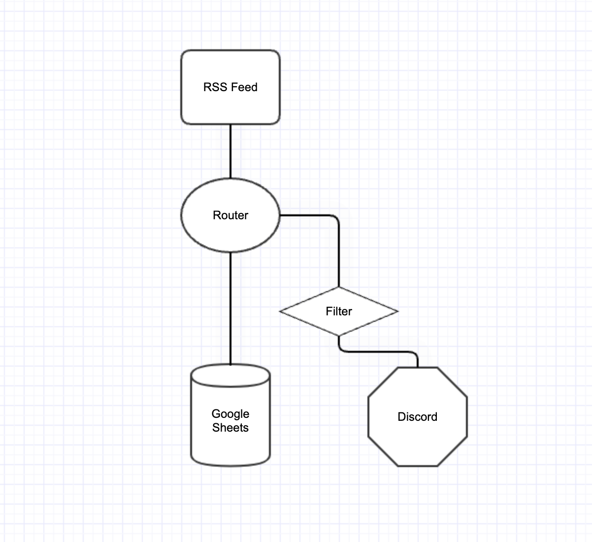
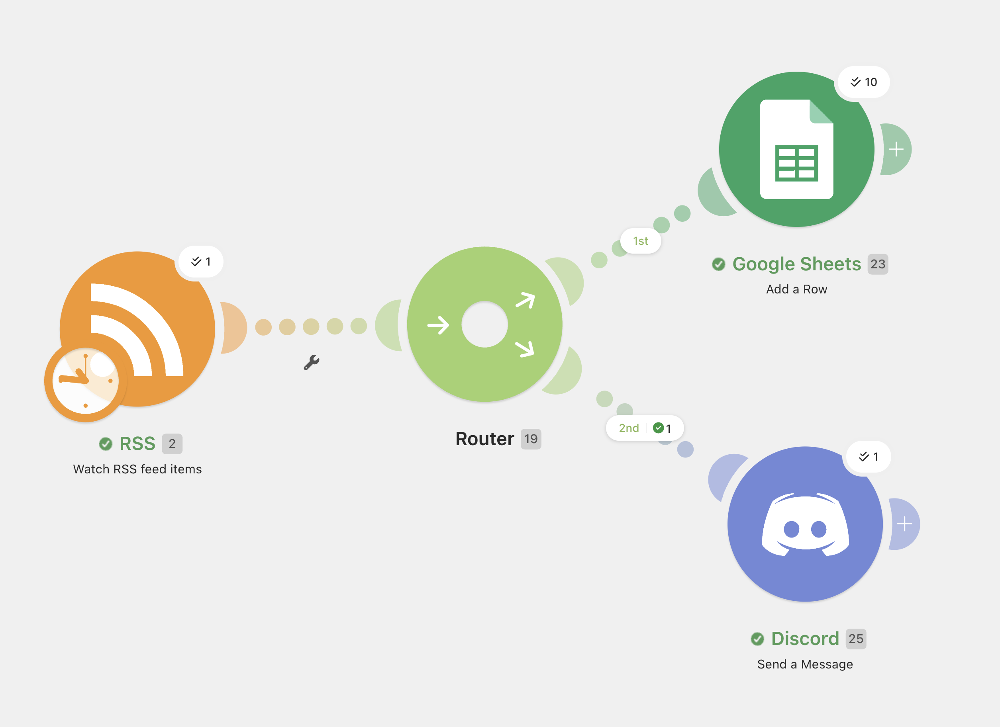
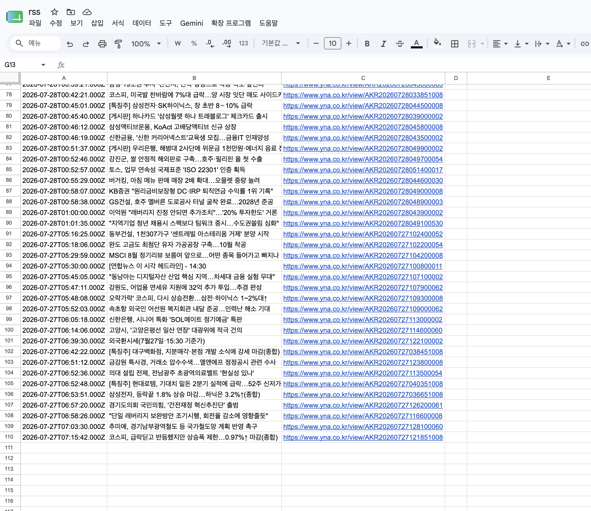
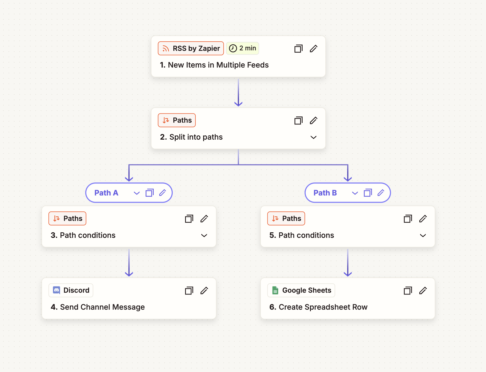
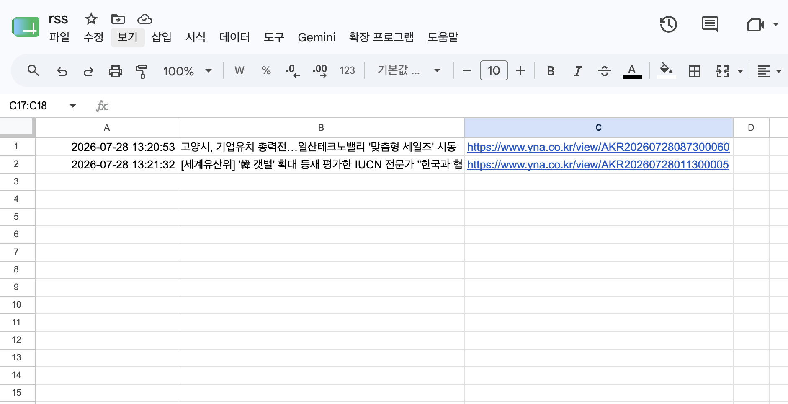
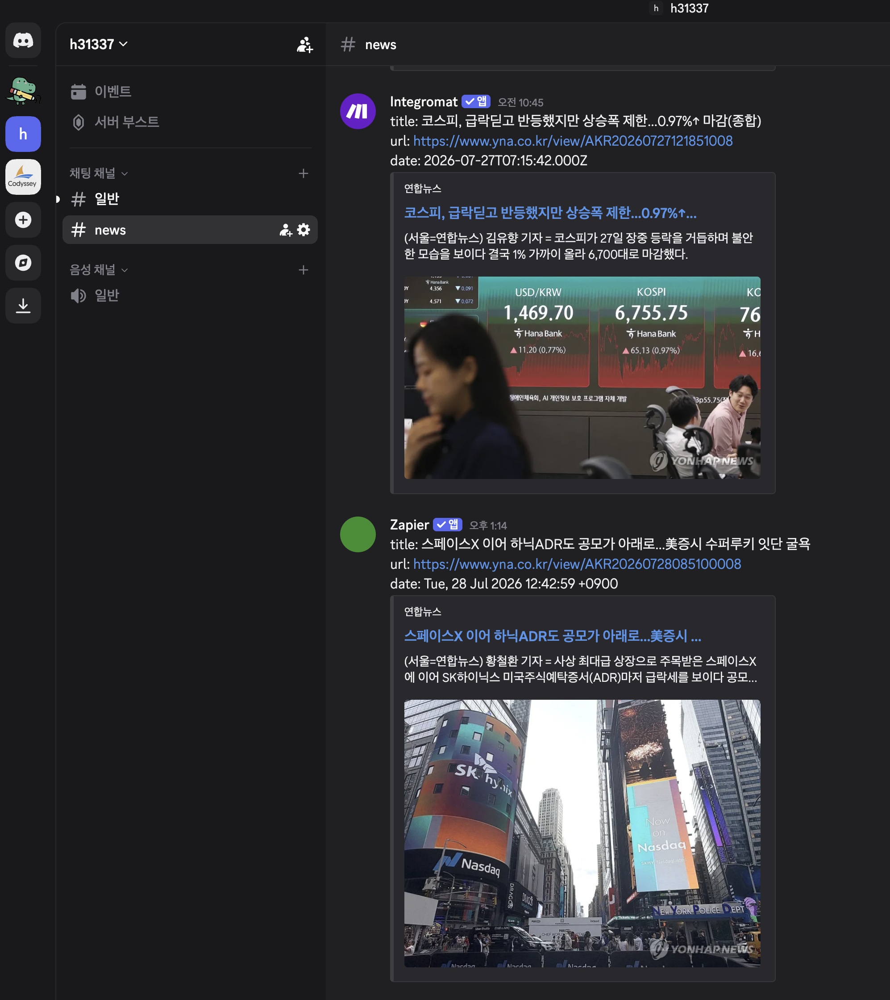

## 자동화 도구 비교 구현 (Make vs Zapier)

### Workflow: 

### Make
#### Workflow

* Trigger: RSS – Watch RSS feed items
* Router: 주식 관련 키워드 탐지 기사 / 전체 기사
* Action 1: Google Sheets – Add a Row (RSS 기사 저장)
* Action 2: Discord – Send a Message (주식 관련 기사 알림)

#### Resulte

### Zapier
#### Workflow

* Trigger: RSS by Zapier - New Item in Feed
* Path conditions: 점주식 관련 키워드 탐지 기사 / 전체 기사
* Action 1: Google Sheets – Create Spreadsheet Row (RSS 기사 저장)
* Action 2: Discord – Send Channel Message (주식 관련 기사 알림)

#### Resulte

### Make vs Zapier 비교
|항목|Zapier|Make|
|------|---|---|
|UI / UX|상하 직선형(Linear) 구조 체크리스트 형태로 직관적이고 깔끔함|캔버스 형태의 순서도(Flowchart) 구조 전체 데이터 흐름을 시각적으로 파악 가능|
|설정 난이도|매우 낮음 (초보자 친화적) 별도의 학습 없이 몇 분 만에 워크플로우(Zap) 구축 가능|중급 (러닝커브 존재) 모듈, 라우터,이터레이터 등의 개념 이해와 데이터 매핑 학습 필요|
|연동 서비스 범위|약 8,000~9,000개 이상의 압도적 생태계  마이너하거나 최신 SaaS 툴도 빠르게 지원|약 3,000~3,500여 개 지원 대중적인 툴은 대부분 지원하나 특수 툴은 부족할 수 있음|
|무료 플랜 범위|월 100 Tasks 제공 액션이 실행된 단계(Task) 기준으로만 차감|월 1,000 Credits(Operations) 제공 테스트 실행, 필터, 모듈 호출 등 모든 단계에서 크레딧 소모|
|실행 로그 확인 방식|히스토리 탭에서 각 Zap별 성공/실패 여부를 리스트 형태로 단순 확인|시나리오 캔버스 내에서 데이터가 흘러간 경로(Bubble)와 각 단계별 입출력 값을 실시간 애니메이션 형태로 상세 추적 가능|