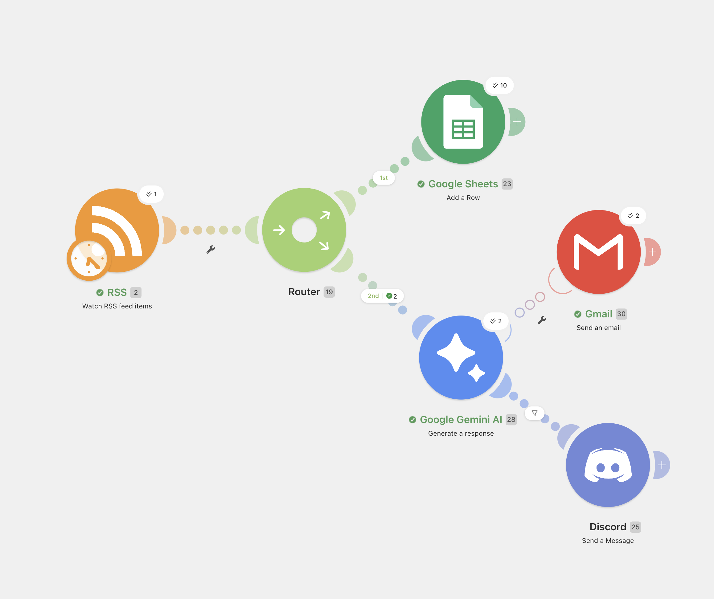
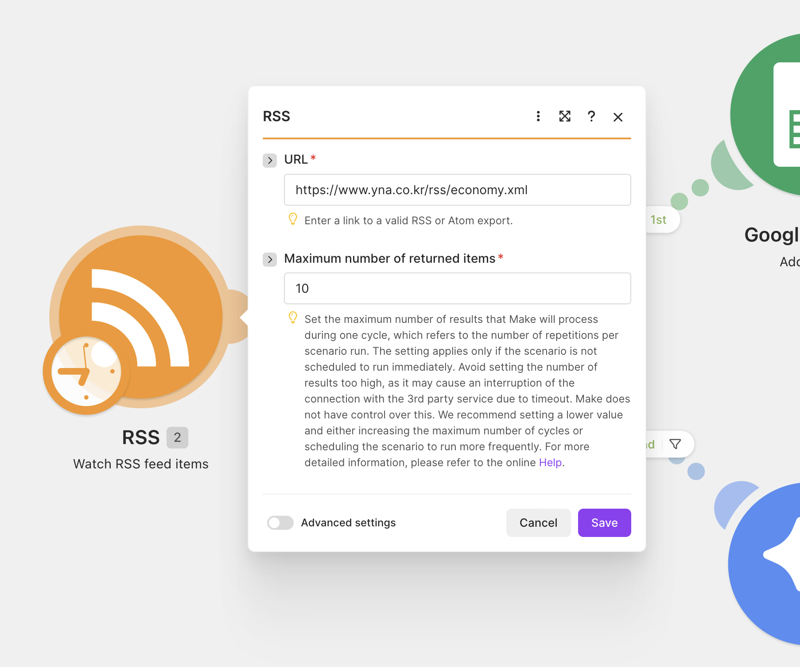
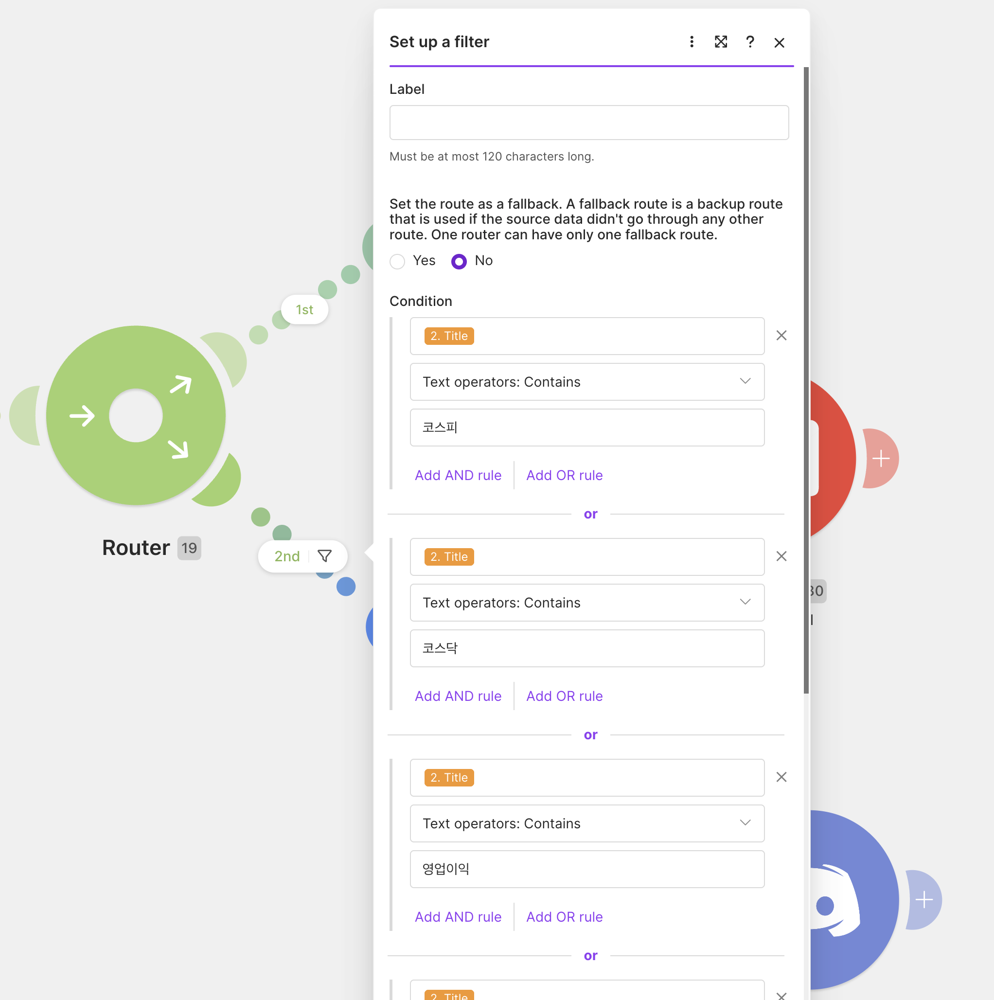
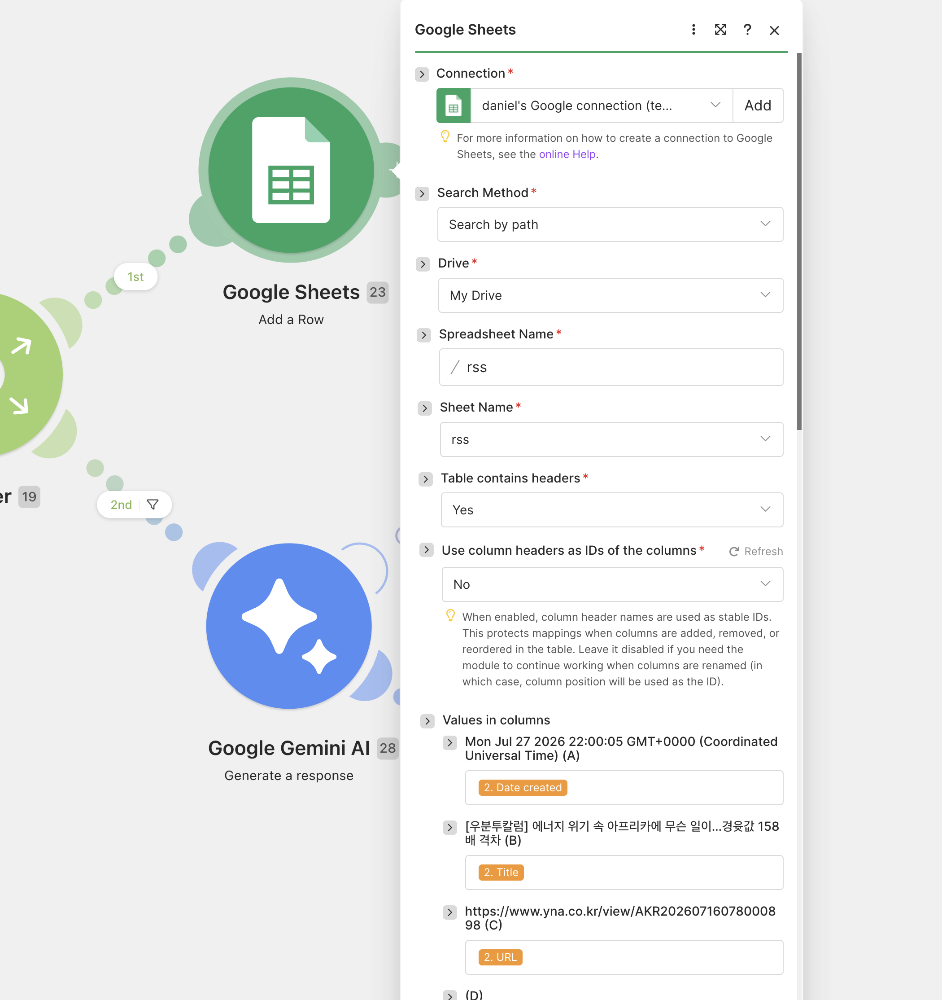
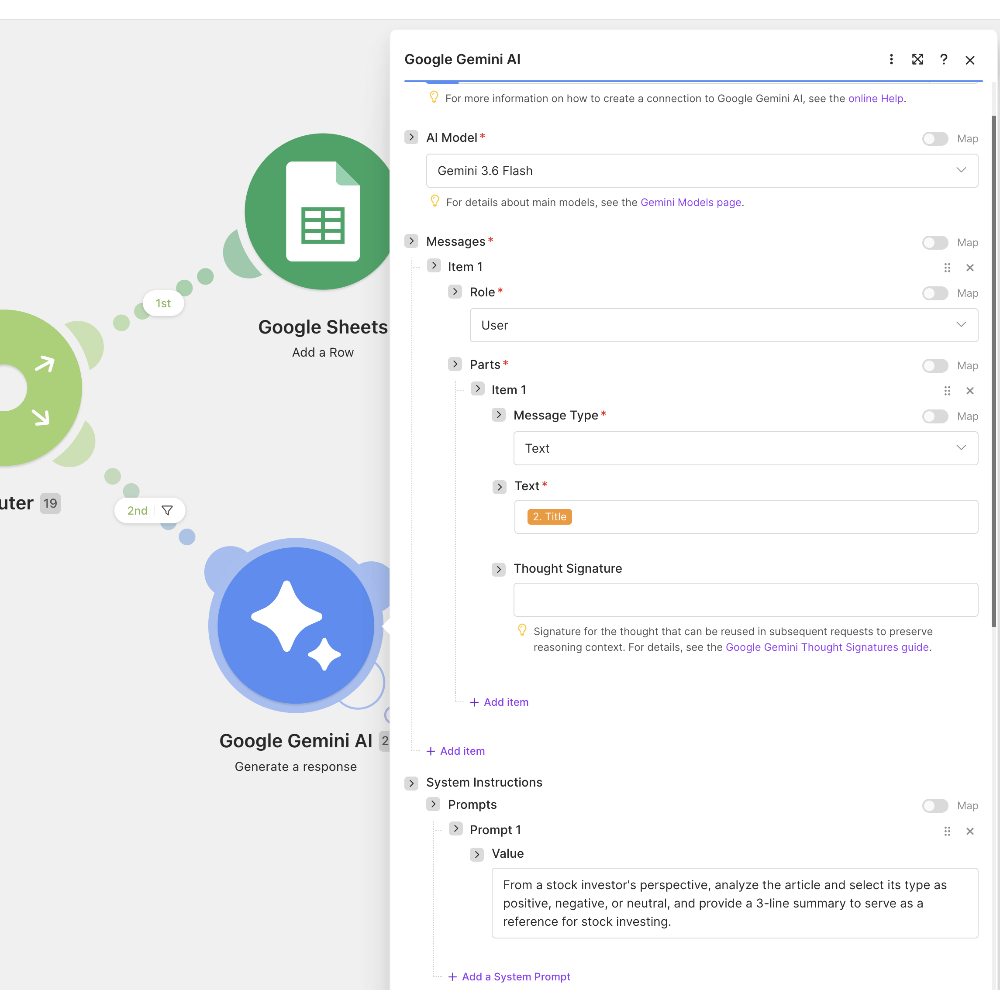
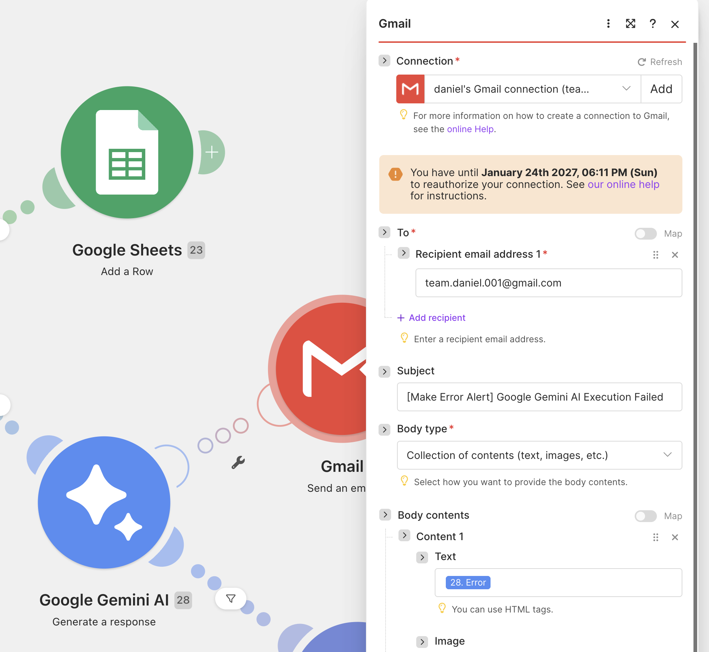
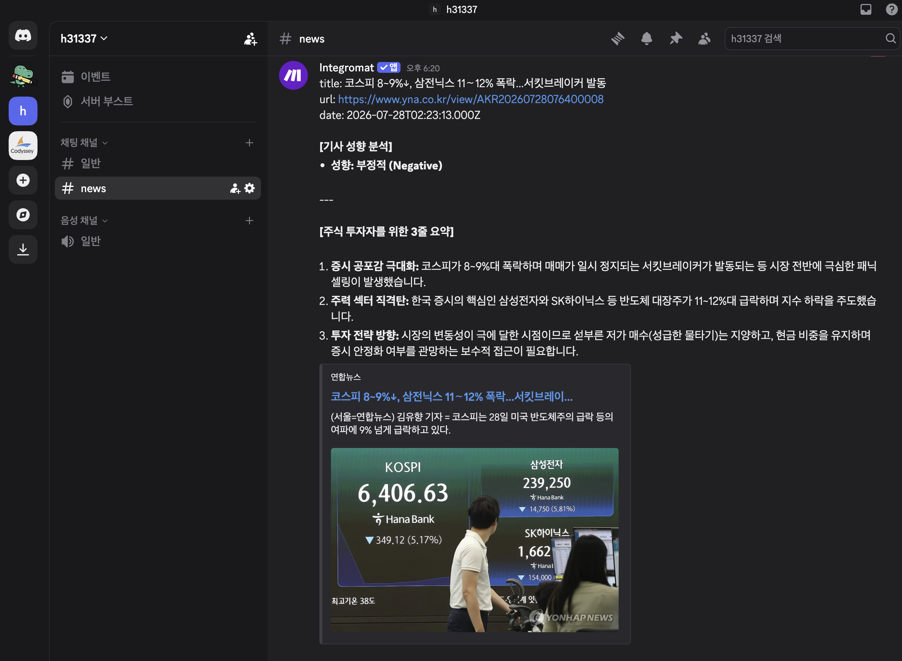
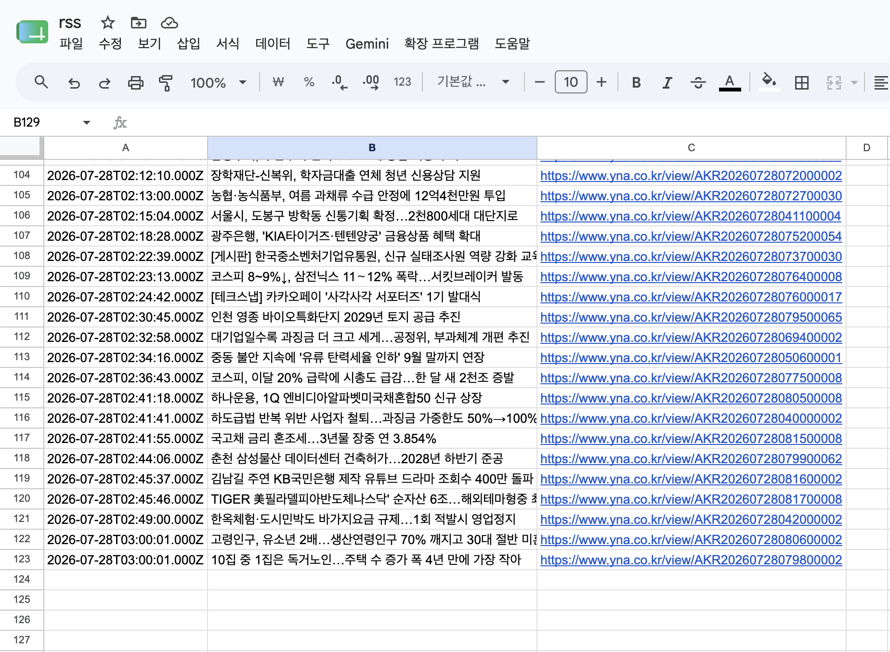
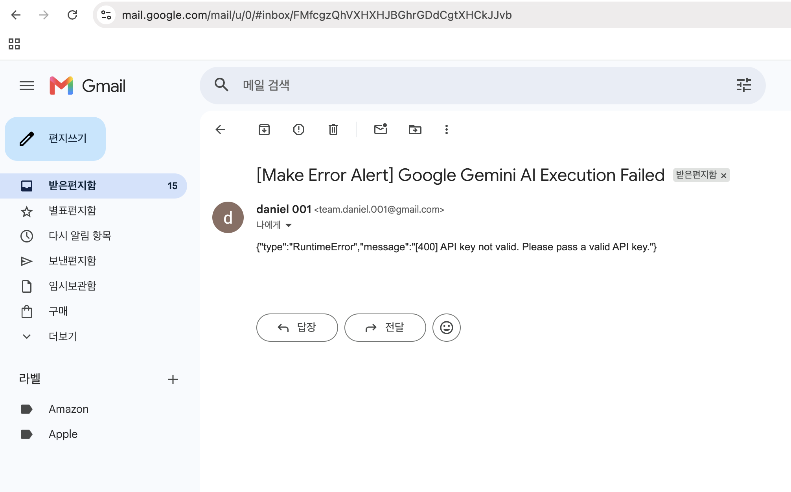

## 주식 투자를 위한 뉴스 자동 수집 및 분석

### Make 사용
Make를 선정한 가장 큰 이유는 직관적이고 간편한 인터페이스 덕분에 초심자도 부담 없이 접근할 수 있기 때문입니다. 특히 RSS 수신 모듈이 제공하는 기능이 다양하고, 제가 구현하고자 하는 워크플로우의 목적에 가장 잘 부합하여 최적의 자동화 환경을 구축할 수 있다고 판단

### Workflow: 

* Trigger: RSS – Watch RSS feed items

* Router: 주식 관련 키워드 탐지 기사 / 전체 기사

* Action 1: Google Sheets – Add a Row (RSS 기사 저장)

* Action 2: Google Gemini AI - Generate a response (기사 분석 3줄 요약)

* Action 3: Discord – Send a Message (주식 관련 기사 알림)

* Error Handler: Gmail - Send an email (Gemini AI 오류 발생시 메일 발송)

### Resulte

